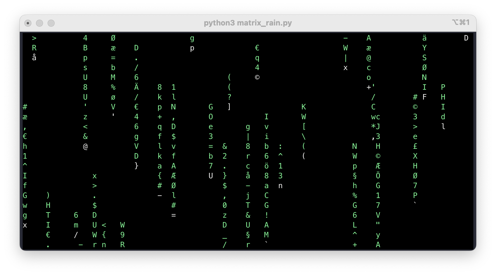
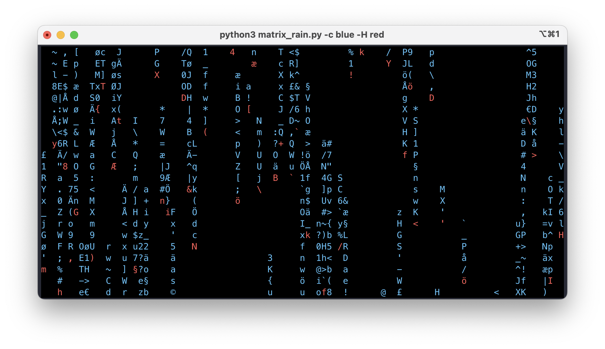

.. _digitail_rain: https://en.wikipedia.org/wiki/Digital_rain
.. _curses: https://docs.python.org/3/howto/curses.html

######################
  Matrix Digital Rain
######################

.. raw:: html
  

<video>
  <source src="./media/screen_running.mp4" type="video/mp4">
</video>

****************
  Introduction
****************

From `Wikipedia <https://en.wikipedia.org/wiki/Digital_rain>`_:

    Matrix digital rain, or Matrix code, is the computer code featured in the Ghost in the Shell series and the Matrix series. The falling green code is a way of representing the activity of the simulated reality environment of the Matrix on screen by kinetic typography.

The classic green body with a white head.

The script has options to control the color of head, body, and background.
Here it is blue body and red head.

This project demonstrates use of the `curses <https://docs.python.org/3/howto/curses.html>`_ module.
I was inspired by 
`Making the Matrix Screensaver in C on a PDP-11/83 <https://youtu.be/-foAV_zU2as?si=1GcCSSo1SPAo0Llh>`_
and had also long wanted to learn how to write an application utilizing `curses <https://docs.python.org/3/howto/curses.html>`_.

****************
  About Curses
****************

* Colors are numbered, and `start_color()` initializes 8 basic colors when it activates color mode.
* Color pair 0 is hard-wired to white on black, and cannot be changed.
* Coordinates are always passed in the order y,x, and the top-left corner of a window is coordinate (0,0)
* Writing to lower right corner will move cursor to new and non-existing(!) line thus raising exception

*******************
  Getting Started
*******************

The code needs Python 3.11 to run due to the type hints in te source code.
I expect you can remove the type hint if you really want to run the code in an old installation.

Dependencies
============

There is no dependencies to run outside the standard installation.

You will need some dependencies to develop and test the application.

Installing
==========

Executing
=========

While developing you can use the :code:`Makefile`

.. code:: bash

  make run

or simply to run with default colors

.. code:: bash

  python3 matrix_rain.py

or with whatever colors you might prefer

.. code:: bash

  python3 matrix_rain.py -c blue -H red

********
  Help
********

********
  TODO
********

* Make screen into an object
* What to do with Microsoft Windows
